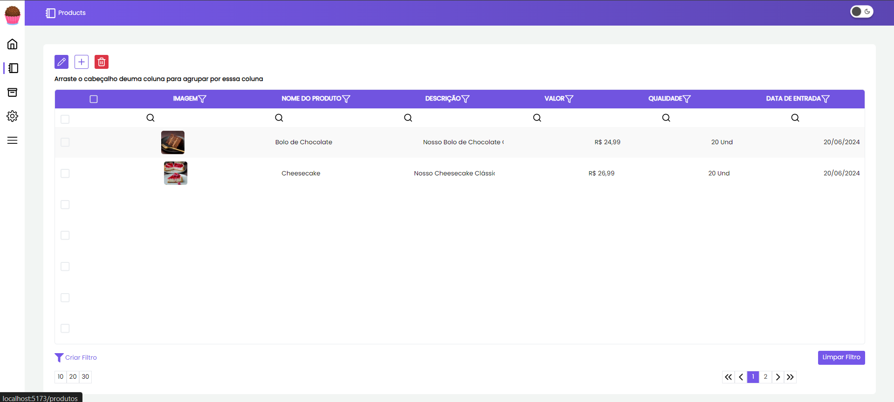
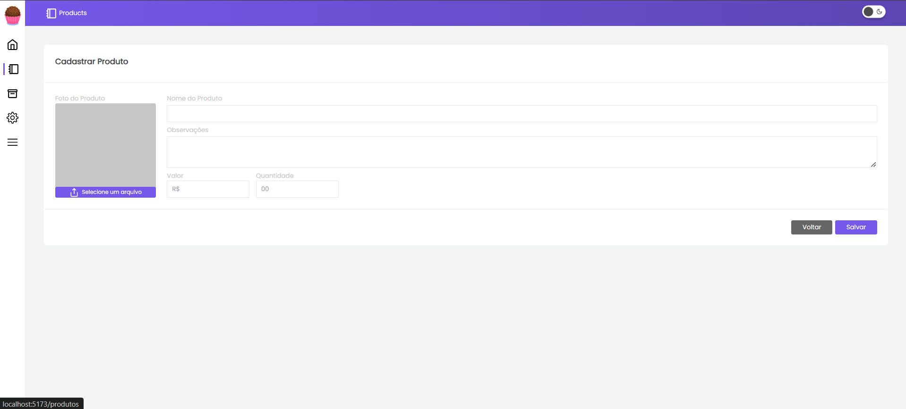
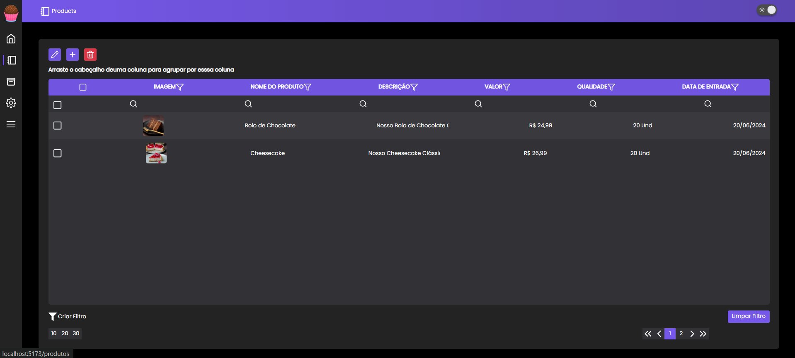
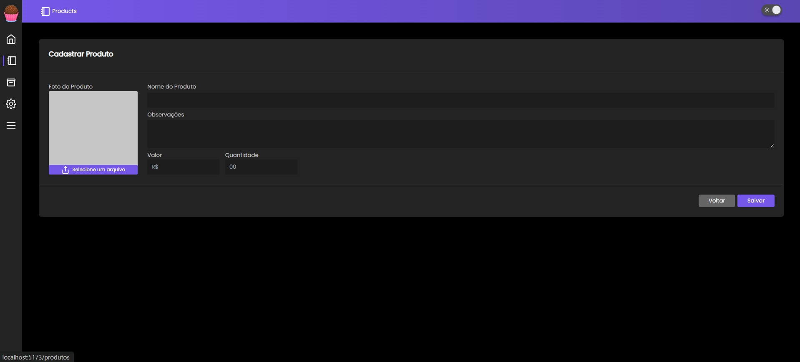

# App-Teste

## Índice

- [Visão Geral](#visão-geral)
  - [Imagens](#Imagens)
- [Funcionalidades](#funcionalidades)
- [Tecnologias Utilizadas](#tecnologias-utilizadas)
- [Começando](#começando)
  - [Pré-requisitos](#pré-requisitos)
  - [Instalação](#instalação)
  - [Executando o Projeto](#executando-o-projeto)
- [Deploy](#deploy)
- [Contribuindo](#contribuindo)
- [Contato](#contato)

## Visão Geral

Demonstrando as minhas habilidades com React.js, desenvolvi este projeto que simula um sistema de gestão de pedidos para o setor alimentício. A aplicação oferece um CRUD completo para os pedidos, permitindo aos usuários realizar as operações de criação, leitura, atualização e deleção de dados de forma simples e eficiente.

## Imagens

Aqui estão algumas imagens do projeto:

<div>
    
    
    
    
</div>

## Funcionalidades

- Listagem de Pedidos
- Foto do produto
- Preço
- Criação de Novos Pedidos
- Edição de Pedidos
- Exclusão de Pedidos

## Tecnologias Utilizadas

- [React.js](https://reactjs.org/)
- [Vite](https://vitejs.dev/)
- [Axios](https://axios-http.com/)
- [Tailwind](https://tailwindcss.com/)
- [MongoDB](https://www.mongodb.com/)

## Começando

### Pré-requisitos

- Node.js (v14.x ou superior)
- npm

### Instalação

1. Clone o repositório:

   ```bash
   git clone https://github.com/DalioSY/app-teste.git
   ```

2. Navegue até o diretório do projeto:

   ```bash
   cd app-server
   ```

   &

   ```bash
   cd app-web
   ```

3. Instale as dependências no app-server e no app-web:

   ```bash
   npm install
   ```

4. No arquivo .env-example na raiz do projeto app-server:

   ```bash
   MONGODB_API_KEY
   ```

#### 4.1. Criar um Cluster no MongoDB Atlas

1. Acesse o site [MongoDB Atlas](https://www.mongodb.com/cloud/atlas) e faça login ou crie uma conta.
2. Crie um novo projeto se necessário.
3. Crie um novo cluster. Escolha as configurações de acordo com suas necessidades (tipo de nuvem, região, etc.).

#### 4.2. Configurar Usuário e Senha

1. No MongoDB Atlas, vá para a seção **Database Access**.
2. Adicione um novo usuário clicando em **Add New Database User**.
3. Defina um nome de usuário e senha. Tome nota dessas informações, pois serão usadas na string de conexão.

#### 4.3. Obter a String de Conexão

1. No MongoDB Atlas, vá para a seção **Clusters**.
2. Clique no botão **Connect** no seu cluster.
3. Selecione **Connect Your Application**.
4. Copie a string de conexão fornecida. Ela terá o seguinte formato:

   ```plaintext
   mongodb+srv://<username>:<password>@users.tcnbh7v.mongodb.net/Test?retryWrites=true&w=majority
   ```

#### 4.4. Atualizar a String de Conexão

Substitua <username> e <password> pelas informações corretas:

<username>: seu nome de usuário do banco de dados.
<password>: sua senha do banco de dados.

#### 4.5. Armazenar a String de Conexão com Segurança

Para manter sua string de conexão segura, é recomendado armazená-la em um arquivo .env (ou variáveis de ambiente) e usar um pacote como dotenv para carregá-la.

Exemplo de como tem que ficar o arquivo .env:<br>
Lembrando para renomear o arquivo .env-exempla para .env

```plaintext
MONGODB_API_KEY ="mongodb+srv://<username>:<password>@users.tcnbh7v.mongodb.net/Test?retryWrites=true&w=majority"
```

### 5. Executando o Projeto

1. Inicie o servidor de desenvolvimento nos dois projetos:

   ```bash
   npm run dev
   ```

2. Abra [http://localhost:5173](http://localhost:5173) no seu navegador para ver o projeto.

## Contribuindo

Contribuições são bem-vindas! Por favor, siga estas etapas para contribuir:

1. Faça um fork do repositório.
2. Crie uma nova branch (`git checkout -b feature/SuaFuncionalidade`).
3. Faça suas alterações.
4. Faça um commit das suas alterações (`git commit -m 'Adicionei uma nova funcionalidade'`).
5. Envie para a branch (`git push origin feature/SuaFuncionalidade`).
6. Crie um novo Pull Request.

## Contato

- **Dalio Shindi Yamada**
- [GitHub](https://github.com/DalioSY)
- [LinkedIn](https://www.linkedin.com/in/dalio-s-yamada)
- [Portfólio](https://daliosy.github.io/my-PORTFOLIO)

## Conclusão

Apesar de não ter finalizado o projeto dentro do prazo previsto, a jornada de desenvolvimento foi repleta de aprendizados. A constante necessidade de buscar novas informações e solucionar problemas me desafiou a expandir meus conhecimentos e habilidades. Reconheço que tenho muito a aprimorar, mas a experiência me motivou a persistir e buscar cada vez mais excelência em meus projetos futuros.
