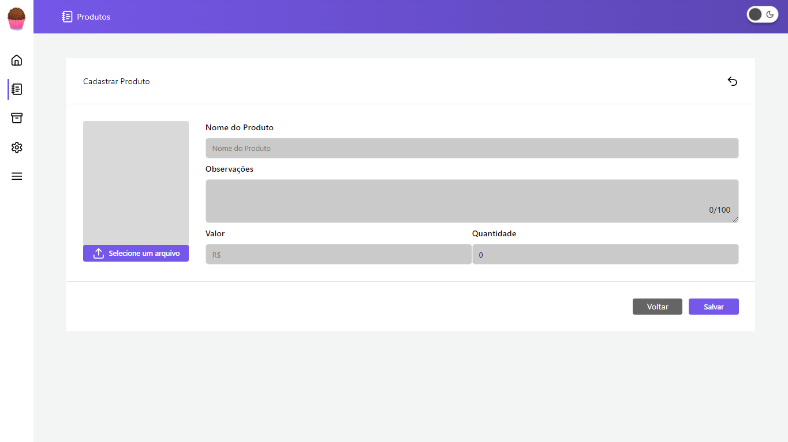

# App-Teste

## Índice

- [Visão Geral](#visão-geral)
  - [Imagens](#Imagens)
- [Funcionalidades](#funcionalidades)
- [Tecnologias Utilizadas](#tecnologias-utilizadas)
- [Começando](#começando)
  - [Pré-requisitos](#pré-requisitos)
  - [Instalação](#instalação)
  - [Executando o Projeto](#executando-o-projeto)
- [Deploy](#deploy)
- [Contribuindo](#contribuindo)
- [Contato](#contato)

## Visão Geral

Demonstrando as minhas habilidades com React.js, desenvolvi este projeto que simula um sistema de gestão de pedidos para o setor alimentício. A aplicação oferece um CRUD completo para os pedidos, permitindo aos usuários realizar as operações de criação, leitura, atualização e deleção de dados de forma simples e eficiente.

## Imagens

Aqui estão algumas imagens do projeto:

<div>
    
    
    
    
</div>

## Funcionalidades

- Listagem de Pedidos
- Foto do produto
- Preço
- Criação de Novos Pedidos
- Edição de Pedidos
- Exclusão de Pedidos

## Tecnologias Utilizadas

- [React.js](https://reactjs.org/)
- [Vite](https://vitejs.dev/)
- [Axios](https://axios-http.com/)
- [Tailwind](https://tailwindcss.com/)
- [MongoDB](https://www.mongodb.com/)

## Começando

### Pré-requisitos

- Node.js (v14.x ou superior)
- npm

### Instalação

1. Clone o repositório:

   ```bash
   git clone https://github.com/DalioSY/app-teste.git
   ```

2. Navegue até o diretório do projeto:

   ```bash
   cd app-server
   ```

   &

```bash
  cd app-web
```

3. Instale as dependências no app-server e no app-web:

   ```bash
   npm install
   ```

4. Crie um arquivo .env-example na raiz do projeto app-server e adicione a chave da API de filmes:

   ```bash
   MONGODB_API_KEY
   ```

### Executando o Projeto

1. Inicie o servidor de desenvolvimento nos dois projetos:

   ```bash
   npm run dev
   ```

2. Abra [http://localhost:5173](http://localhost:5173) no seu navegador para ver o projeto.

## Contribuindo

Contribuições são bem-vindas! Por favor, siga estas etapas para contribuir:

1. Faça um fork do repositório.
2. Crie uma nova branch (`git checkout -b feature/SuaFuncionalidade`).
3. Faça suas alterações.
4. Faça um commit das suas alterações (`git commit -m 'Adicionei uma nova funcionalidade'`).
5. Envie para a branch (`git push origin feature/SuaFuncionalidade`).
6. Crie um novo Pull Request.

## Contato

- **Dalio Shindi Yamada**
- [GitHub](https://github.com/DalioSY)
- [LinkedIn](https://www.linkedin.com/in/dalio-s-yamada)
- [Portfólio](https://daliosy.github.io/my-PORTFOLIO)
